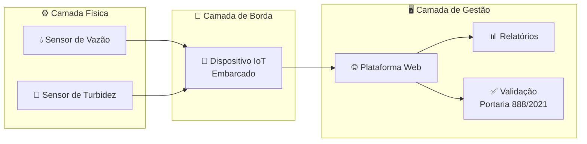

<div align="center">

<!-- Badges -->


<br/>

# 💧 SIGUA - Sistema IoT para Monitoramento de Vazão e Turbidez

**ETA Júlio Campos – DAE Várzea Grande, Mato Grosso**

> Coleta automática · Validação legislativa · Relatórios técnicos

<br/>

| 👩‍💻 Aluna | 📚 Disciplina | 🏷️ Tipo | 📍 Local |
|:---:|:---:|:---:|:---:|
| Emmylly Maria dos Santos Oliveira | Extensão II | Protótipo funcional em ambiente operacional | ETA Júlio Campos – DAE Várzea Grande |

</div>

---

## 📌 Visão de Produto

Para os **responsáveis técnicos da ETA Júlio Campos** do DAE de Várzea Grande, que precisam monitorar continuamente a vazão e a turbidez da água distribuída e verificar sua conformidade com a legislação, o **Sistema de Monitoramento de Vazão e Turbidez da Água** é um sistema integrado composto por um dispositivo IoT com sensores e uma plataforma web de gestão, que realiza a **coleta automática e periódica** dos dados de vazão e turbidez da água tratada, valida os valores conforme a **Portaria GM/MS nº 888/2021** e gera **relatórios técnicos de acompanhamento**.

> **Diferente de** processos manuais baseados em formulários e planilhas, nosso produto **automatiza a aquisição dos dados**, organiza as informações de monitoramento e consolida relatórios de conformidade, garantindo rastreabilidade das medições, maior confiabilidade dos registros e apoio à tomada de decisão operacional.

---

## ❌ Problema vs ✅ Solução

| ❌ Processo Atual | ✅ Com o Sistema |
|:---|:---|
| Coleta manual com formulários | Aquisição automática e periódica |
| Registros em planilhas desconexas | Dados centralizados na plataforma web |
| Baixa rastreabilidade das medições | Rastreabilidade total das medições |
| Risco de falha humana nos registros | Validação automática conforme legislação |
| Relatórios elaborados manualmente | Relatórios técnicos gerados automaticamente |

---

## 📊 Métricas do Relatório Gerado

| 🔢 Amostras exigidas | ✅ Amostras realizadas | 📋 Em conformidade | 📈 Média mensal |
|:---:|:---:|:---:|:---:|
| Quantidade prevista pela Portaria GM/MS nº 888/2021 | Total coletado no período | Percentual dentro do padrão | Valor médio + limite permitido |

Cada relatório consolidado contém:

- 🔢 **Quantidade de amostras exigidas** pela Portaria GM/MS nº 888/2021
- ✅ **Amostras realizadas** no período
- 📋 **Amostras em conformidade** com o padrão de qualidade
- 📈 **Média mensal** do parâmetro monitorado
- 📏 **Valor permitido** do parâmetro conforme legislação vigente

---

## 🏗️ Arquitetura do Sistema



### Camada Física — Sensores
- **Sensor de vazão**: mede o volume de água distribuída por unidade de tempo
- **Sensor de turbidez**: mede a quantidade de partículas suspensas na água tratada

### Camada de Borda — Dispositivo IoT
- Coleta periódica e automática dos dados dos sensores
- Processamento local e transmissão para a plataforma central

### Camada de Gestão — Plataforma Web
- Visualização em tempo real dos parâmetros monitorados
- Validação automática dos valores conforme Portaria GM/MS nº 888/2021
- Geração de relatórios técnicos de acompanhamento
- Apoio à tomada de decisão operacional

---

## ⚖️ Base Legal

<div align="center">

**📜 Portaria GM/MS nº 888/2021 – Ministério da Saúde**

</div>

Estabelece os procedimentos e responsabilidades relativos ao controle e vigilância da qualidade da água para consumo humano, incluindo:

- Padrões de **turbidez** para água distribuída
- Requisitos de **monitoramento de vazão** em sistemas de abastecimento
- Frequência mínima de **coleta de amostras** por porte do sistema
- Parâmetros de **conformidade** e notificação obrigatória

---

## 🛠️ Tecnologias e Componentes


---

## 📂 Estrutura do Projeto

```
SistEMA-IOT-Para-Monitoramento-de-Vaz-o-e-Turbidez
├── core/                       # Configurações centrais do Django (settings, urls)
├── monitoramento/              # App principal (US13 e US14)
│   ├── migrations/
│   ├── templates/              # HTML do Dashboard (US14)
│   │   └── dashboard.html
│   ├── api/                    # Lógica da API de recebimento (US13)
│   │   └── views_api.py
│   ├── admin.py                # Interface administrativa
│   ├── models.py               # Definição das tabelas (US07 e US13)
│   ├── urls.py                 # Rotas do App
│   └── views.py                # Lógica de exibição do Dashboard (US14)
├── static/                     # CSS, JS e Imagens (Bootstrap)
├── manage.py
├── .env                        # Credenciais do PostgreSQL
└── requirements.txt
```


<div align="center">

**Emmylly Maria dos Santos Oliveira** · Extensão II  
ETA Júlio Campos – DAE Várzea Grande · Mato Grosso, Brasil

<br/>

🟢 *Protótipo funcional em ambiente operacional*

</div>
